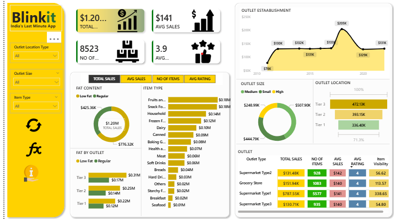
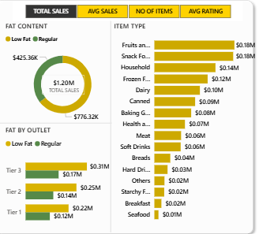
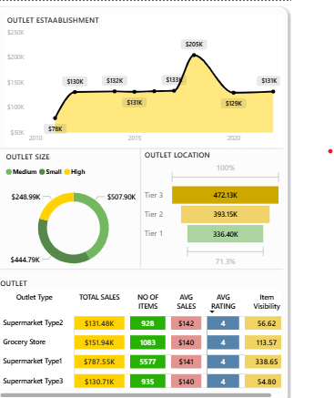

# 🛒 Blinkit Power BI Dashboard

Power BI Dashboard for Blinkit Sales & Operations Analysis

## 📌 Project Overview
This project presents an interactive Power BI dashboard built to analyze Blinkit’s sales and operational performance.
It helps understand sales trends, outlet performance, and product category contributions.

## 🎯 Objectives
- Analyze total and average sales
- Compare outlet performance by size and location
- Identify top-performing product categories
- Understand year-wise sales trends

## 🛠 Tools Used
- Power BI
- Microsoft Excel

## 📊 Dashboard Preview

### Overview

### Sales & Category Analysis

### Outlet & Location Analysis

## 📂 Files Included
- `BLINK IT DASHBORD.pbix`
- `BLINK IT DASHBORD.pdf`
- `images/` – Dashboard screenshots

## 👩‍💻 Created By
**Kotrike Bhavya**

